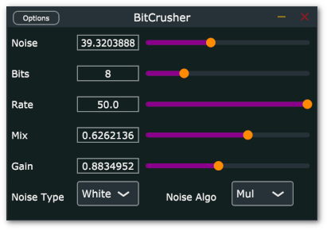

# BitCrusher Demo (v2)

A simple bitcrusher plugin inspired by a tutorial by Aaron Leese (Stagecraft Software) and Joshua Hodge from the [The Audio Programmer](https://www.youtube.com/channel/UCpKb02FsH4WH4X_2xhIoJ1A/about). 

The plugin is the result of me following along with the tutorial and then trying to add a bunch of improvements and extra features in order to learn the basics of the [JUCE](https://juce.com/) framework. 

If you are just getting started, I suggest taking a look at the original tutorial and code first: 

* [Juce Tutorial 39- Bitcrusher Plugin Walkthrough with Aaron Leese (Stagecraft Software)](https://www.youtube.com/watch?v=1PLn8IAKEb4) 
* [GitHub repo](https://github.com/theaudioprogrammer/bitcrusherDemo)

## Plugin details/additions

### New Features

* _mix_: controlling dry/wet ratio 
* _noise type_: chose between white and "simple" noise (TODO: add other type of noise)
* _noise algorythm_: chose whether noise is added or multiplied with the original signal
* _gain_: control the global output

### Improvements

* make use of `AudioProcessorValueTreeState` to manage plugin state and keep it in sync with the GUI. This considerably reduces code size and number of errors, highly recommended. See [Tutorial: Saving and loading your plug-in state](https://docs.juce.com/master/tutorial_audio_processor_value_tree_state.html).
* make use of `getStateInformation` and `getStateInformation` so that plugin state can be saved within your DAW session (again, see [Tutorial: Saving and loading your plug-in state](https://docs.juce.com/master/tutorial_audio_processor_value_tree_state.html), as well as other JUCE tutorials)
* make use of `removeFromTop`, `removeFromLeft` (& friends) to build the GUI, instead of specifiying everything with fixed positions. See [Tutorial: Advanced GUI layout techniques](https://docs.juce.com/master/tutorial_rectangle_advanced.html)
* the _bitrate_ slider only shows integers
